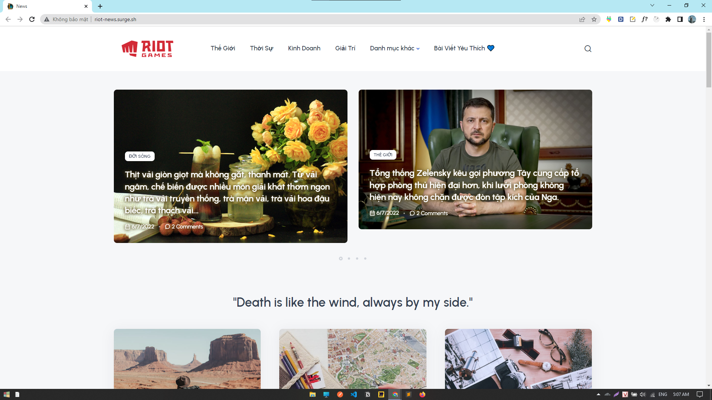

# Newspaper - News Website
Riot is a dynamic website used to read news that supports responsive on mobile devices. This website uses jquery and ajax to get data from the API. In addition, it also supports a number of other features such as using LocalStorage to do the heart drop function, commenting on posts and adding articles to the favorites list.

## Preview

**[Visit My Website](http://riot-news.surge.sh)**

## Features
- Sử dụng Axios và Jquery để lấy thông tin tin tức từ api
- Sử dụng UrlParam để hiển thị bài viết chi tiết và Filter bài viết dựa trên category
- Tính năng comment, thả tim bài viết 
- Lưu bài viết yêu thích vào danh mục
- Sử dụng LocalStorage để lưu id comment và id bài viết
- Favorite Page show Article via LocalStorage
- Hỗ trợ responsive trên các thiết bị điện tử.

### Cách làm trang Favorite
1. Render các bài viết yêu thích
2. Unlike xóa bài viết ra khỏi page

#### 1. Render favorite
1. lấy danh sách id bài viết yêu thích từ local
2. lấy từng id duyệt mảng call api/id
3. append bài viết trả về từ api -> UI

#### 2. Unlike Delete Article
0. gọi fn handleLike -> chức năng thêm và xóa bài viết ra khỏi localStorage
1. viết thêm 1 fn bắt sự kiện click vào document ? .btn-like thì
2. thực hiện chức năng xóa ra khỏi dom

## Core Structure
mục đích viết 1 chổ sử dụng lại.

#### 0. components: Funtion UI -> tái sử dụng.
Render Menu Category
Render Big Post
Render Small Post

#### 1. constants : code convention
define api

#### 2. modules: tính năng.
like-btn

#### 3. hooks : Hàm thực hiện 1 chức năng cụ thể gì đó.
useSearchID = lấy id từ URLSearch
countComment = load idCMT từ localStorage

#### 4. services: define call api independent
article
  + getArticle

category
  + getCategory

-> Liên quan đến bất đồng bộ, chưa đủ trình

## API Reference

#### Provided by zendvn
```html
  http://apiforlearning.zendvn.com/
```

This project is made by me and my instructor Linh Master
#### That All, Thanks ❤